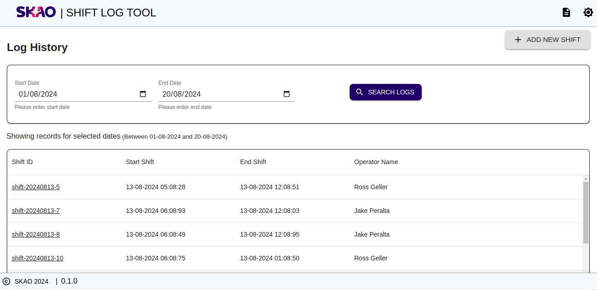
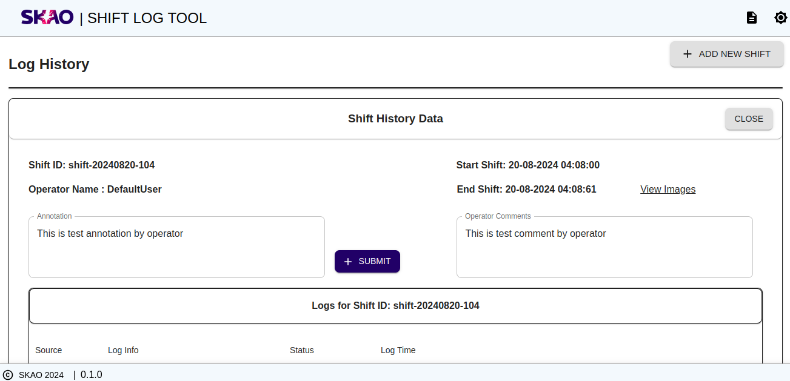

SKA OSO Shift Log Tool (SLT) UI
~~~~~~~~~~~~~~~~~~~~~~~~~~~~~~~~~~~~~~~~~~~~~~~~~~~~

The Shift Log Tool (SLT) is one of the main tools in the OSO suite and will find use in the early AIV and commissioning phases of the telescopes. 
An early first version will allow feedback on its appearance and features before entering real use in AA0.5.

This is a initial UI flow for Shift Log Tool where user will be able to query ODA.
User will be able to search Shift by a Start Date and End Date and also by operator name.

Log history page
-----------------

|

View log history
-----------------

|

New shift page 
---------------

.. figure:: newShift.png 
   :align: center

|
